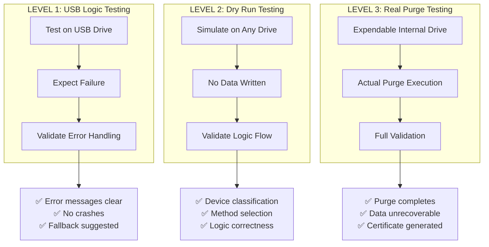
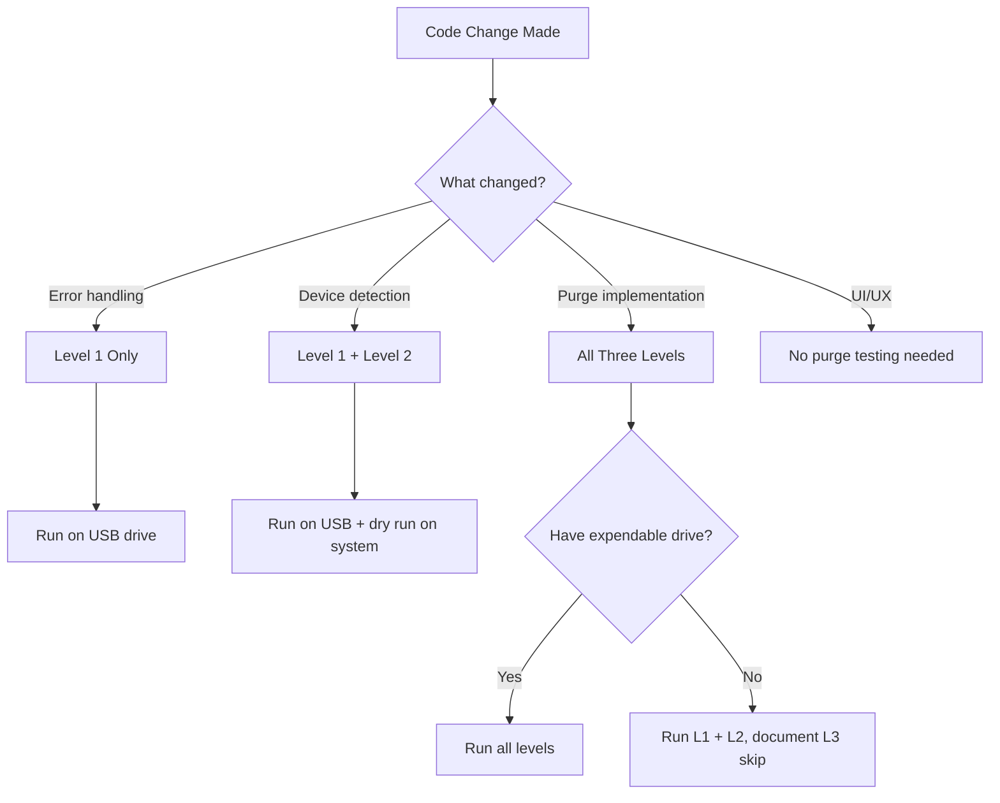

# DropDrive Purge Testing Strategy

## Official Testing Framework for NIST 800-88 Purge Operations

> **Document Version:** 1.0  
> **Last Updated:** December 29, 2024  
> **Applies To:** DropDrive v0.1.0+

---

## 📋 Executive Summary

This document defines the **official three-level purge testing strategy** for DropDrive. It establishes clear, safe, and realistic test procedures that developers can follow to validate purge functionality without risking data loss or hardware damage.

### Key Principles

1. **Safety First** - Most testing happens on USB drives where purge *should fail*
2. **Failure is Expected** - Graceful failure handling is a core test objective
3. **Realistic Scope** - Real purge testing is optional and requires expendable hardware

---

## 🎯 Understanding Purge Methods

### What is Purge?

**Purge** is the NIST 800-88 sanitization level between Clear and Destroy. It uses specialized hardware commands to erase data at the firmware/controller level:

| Purge Method | Target Hardware | Command Type |
|--------------|-----------------|--------------|
| **ATA Secure Erase** | SATA HDDs/SSDs | ATA Security Feature Set |
| **NVMe Sanitize** | NVMe SSDs | NVMe Admin Command |
| **Crypto Erase** | Self-Encrypting Drives (SEDs) | Key destruction |

### Why Purge Fails on USB Drives

> [!IMPORTANT]
> **USB flash drives do NOT support purge commands.** This is by design, not a bug.

**Technical Explanation:**

```
USB Flash Drive Architecture:
┌────────────────────────────────┐
│     USB Mass Storage Class     │  ← Generic protocol layer
├────────────────────────────────┤
│    USB-to-Flash Controller     │  ← Translation layer (no ATA/NVMe)
├────────────────────────────────┤
│       NAND Flash Chips         │  ← Raw storage
└────────────────────────────────┘

SATA SSD Architecture:
┌────────────────────────────────┐
│      SATA AHCI Protocol        │  ← Direct ATA commands
├────────────────────────────────┤
│     SSD Controller + DRAM      │  ← Full ATA Security support
├────────────────────────────────┤
│       NAND Flash Array         │  ← Raw storage
└────────────────────────────────┘
```

**Why USB Fails:**
- USB Mass Storage Protocol only supports basic READ/WRITE commands
- No pathway for ATA Security or NVMe Admin commands
- USB controller translates everything to simple block operations
- Even USB-to-SATA/NVMe adapters rarely pass through security commands

---

## 🧪 Testing Levels Overview



---

## 🔷 LEVEL 1: USB Logic Testing

### Purpose

Validate that DropDrive's purge logic correctly **detects device limitations** and **fails gracefully** when attempting purge operations on unsupported devices.

### Test Environment

| Requirement | Specification |
|-------------|---------------|
| **Hardware** | Any USB flash drive (8GB-32GB recommended) |
| **Data Safety** | No risk - purge commands won't execute |
| **Time Required** | < 5 minutes per test |
| **Frequency** | Every code change to purge logic |

### What to Test

| Purge Method | Expected Result | Why |
|--------------|-----------------|-----|
| ATA Secure Erase | FAIL | USB has no ATA Security Feature Set |
| NVMe Sanitize | FAIL | USB is not an NVMe device |
| Crypto Erase | FAIL | USB has no TPM/encryption keys |

### Pass Criteria ✅

A test **PASSES** if ALL of the following are true:

| Criterion | Description | How to Verify |
|-----------|-------------|---------------|
| **Correct Device Detection** | USB identified as removable/USB type | Check device info shows "Removable" or "USB" |
| **Method Recognition Failure** | System correctly identifies purge not supported | Error message mentions lack of support |
| **Clear Error Message** | User-friendly explanation provided | Error text is readable, not cryptic codes |
| **No Application Crash** | App remains stable after failure | UI still responsive, can navigate away |
| **Fallback Suggested** | Alternative method recommended | Message suggests Clear/Destroy instead |

### Fail Criteria ❌

A test **FAILS** if ANY of the following occur:

| Criterion | Description | Severity |
|-----------|-------------|----------|
| **App Crashes** | Application terminates unexpectedly | 🔴 Critical |
| **Misleading Success** | Operation reports success when it shouldn't | 🔴 Critical |
| **No Error Message** | Silent failure with no user feedback | 🟡 Major |
| **Cryptic Error** | Raw Windows error code without explanation | 🟡 Major |
| **Wrong Device Type** | USB misidentified as NVMe/SATA | 🟡 Major |
| **No Fallback Offered** | User left without alternatives | 🟠 Minor |

### Test Procedure

```bash
# Step 1: Build the native addon
cd c:\Users\Hp\Desktop\Disk_cleaner\DropDrive_forked\native
npx node-gyp rebuild

# Step 2: Identify your test USB drive
# Open Disk Management (Win+X → Disk Management)
# Insert USB and note the Disk number (e.g., Disk 2)
# Your path will be: \\.\PhysicalDrive2

# Step 3: Run the USB logic test script
cd c:\Users\Hp\Desktop\Disk_cleaner\DropDrive_forked
node electron/testPurgeUSB.js
```

### Test Script Template

Create `electron/testPurgeUSB.js`:

```javascript
/**
 * LEVEL 1: USB Logic Testing
 * 
 * Purpose: Verify that purge methods fail gracefully on USB drives
 * Expected: ALL purge attempts should FAIL with clear messages
 */

const path = require('path');

// Load the native addon
const addonPath = path.join(__dirname, '..', 'native', 'build', 'Release', 'wipeAddon.node');
const addon = require(addonPath);

// ⚠️ SET YOUR USB DRIVE PATH HERE
const USB_DRIVE = '\\\\.\\PhysicalDrive2';  // VERIFY THIS IS USB!

console.log('═══════════════════════════════════════════════════════════');
console.log('  LEVEL 1: USB LOGIC TESTING');
console.log('  Testing purge method failure behavior on USB drive');
console.log('═══════════════════════════════════════════════════════════');
console.log(`\nTarget: ${USB_DRIVE}`);
console.log('\nExpected: All tests should FAIL with clear error messages');
console.log('Pass Condition: Graceful failures, no crashes\n');

const results = {
    ataSecureErase: { passed: false, message: '' },
    nvmeSanitize: { passed: false, message: '' },
    cryptoErase: { passed: false, message: '' }
};

// Test 1: ATA Secure Erase
console.log('─── Test 1: ATA Secure Erase ───');
try {
    const result = addon.ataSecureErase(USB_DRIVE, false);
    if (result === false) {
        console.log('✅ PASS: Correctly returned failure');
        results.ataSecureErase = { passed: true, message: 'Returned false (expected)' };
    } else {
        console.log('❌ FAIL: Unexpectedly returned success');
        results.ataSecureErase = { passed: false, message: 'Unexpected success' };
    }
} catch (error) {
    // Failures with exceptions are also valid
    const isGraceful = !error.message.includes('CRASH') && 
                       !error.message.includes('ACCESS_VIOLATION');
    if (isGraceful) {
        console.log(`✅ PASS: Failed with message: ${error.message}`);
        results.ataSecureErase = { passed: true, message: error.message };
    } else {
        console.log(`❌ FAIL: Ungraceful error: ${error.message}`);
        results.ataSecureErase = { passed: false, message: error.message };
    }
}

// Test 2: NVMe Sanitize
console.log('\n─── Test 2: NVMe Sanitize ───');
try {
    const result = addon.nvmeSanitize(USB_DRIVE, 'crypto');
    if (result === false) {
        console.log('✅ PASS: Correctly returned failure');
        results.nvmeSanitize = { passed: true, message: 'Returned false (expected)' };
    } else {
        console.log('❌ FAIL: Unexpectedly returned success');
        results.nvmeSanitize = { passed: false, message: 'Unexpected success' };
    }
} catch (error) {
    const isGraceful = !error.message.includes('CRASH');
    if (isGraceful) {
        console.log(`✅ PASS: Failed with message: ${error.message}`);
        results.nvmeSanitize = { passed: true, message: error.message };
    } else {
        console.log(`❌ FAIL: Ungraceful error: ${error.message}`);
        results.nvmeSanitize = { passed: false, message: error.message };
    }
}

// Test 3: Crypto Erase
console.log('\n─── Test 3: Crypto Erase ───');
try {
    const result = addon.cryptoErase(USB_DRIVE);
    if (result === false) {
        console.log('✅ PASS: Correctly returned failure');
        results.cryptoErase = { passed: true, message: 'Returned false (expected)' };
    } else {
        console.log('❌ FAIL: Unexpectedly returned success');
        results.cryptoErase = { passed: false, message: 'Unexpected success' };
    }
} catch (error) {
    const isGraceful = !error.message.includes('CRASH');
    if (isGraceful) {
        console.log(`✅ PASS: Failed with message: ${error.message}`);
        results.cryptoErase = { passed: true, message: error.message };
    } else {
        console.log(`❌ FAIL: Ungraceful error: ${error.message}`);
        results.cryptoErase = { passed: false, message: error.message };
    }
}

// Summary
console.log('\n═══════════════════════════════════════════════════════════');
console.log('  TEST SUMMARY');
console.log('═══════════════════════════════════════════════════════════');

const allPassed = Object.values(results).every(r => r.passed);

Object.entries(results).forEach(([test, result]) => {
    const status = result.passed ? '✅ PASS' : '❌ FAIL';
    console.log(`${test}: ${status}`);
    console.log(`   Message: ${result.message}`);
});

console.log('\n─── OVERALL RESULT ───');
if (allPassed) {
    console.log('✅ ALL TESTS PASSED');
    console.log('   USB purge logic is working correctly');
    console.log('   Failures were graceful and informative');
} else {
    console.log('❌ SOME TESTS FAILED');
    console.log('   Review implementation for error handling');
}
```

---

## 🔶 LEVEL 2: Dry Run Purge Testing

### Purpose

Validate the **logical correctness** of purge workflows without performing any actual data destruction. This tests decision logic, device classification, and method selection.

### Test Environment

| Requirement | Specification |
|-------------|---------------|
| **Hardware** | Any connected drive (USB, SATA, NVMe) |
| **Data Safety** | Complete safety - no writes performed |
| **Time Required** | < 2 minutes per test |
| **Frequency** | Every code change to purge workflow |

### What to Test

1. **Device Classification** - Is the device correctly identified?
2. **Method Selection** - Is the appropriate purge method chosen?
3. **Prerequisite Checks** - Are all pre-conditions evaluated?
4. **Logical Branching** - Does the code follow the correct path?

### Pass Criteria ✅

| Criterion | Description | How to Verify |
|-----------|-------------|---------------|
| **Correct Classification** | Drive type (NVMe/SATA/USB) accurately detected | Log output shows correct type |
| **Appropriate Method** | Selected purge method matches device capability | Method name corresponds to device |
| **Prerequisite Validation** | All checks run (frozen status, security, etc.) | Log shows check sequence |
| **No False Starts** | Dry run does NOT begin any write operations | No disk I/O in monitoring tools |
| **Complete Logging** | All decision points logged | Can trace the logic path |

### Fail Criteria ❌

| Criterion | Description | Severity |
|-----------|-------------|----------|
| **Wrong Device Type** | SATA identified as NVMe or vice versa | 🔴 Critical |
| **Wrong Method Selected** | NVMe Sanitize attempted on SATA drive | 🔴 Critical |
| **Missing Checks** | Security state not validated | 🟡 Major |
| **Writes Occurred** | Data modification in dry run mode | 🔴 Critical |
| **Incomplete Logs** | Cannot determine decision path | 🟠 Minor |

### Test Procedure

```bash
# Run the dry run test
cd c:\Users\Hp\Desktop\Disk_cleaner\DropDrive_forked
node electron/testPurgeDryRun.js
```

### Dry Run Test Script Template

Create `electron/testPurgeDryRun.js`:

```javascript
/**
 * LEVEL 2: Dry Run Purge Testing
 * 
 * Purpose: Validate purge logic without any actual data destruction
 * Expected: Logical flow is correct, no disk writes occur
 */

const path = require('path');

// Configuration
const DRY_RUN = true;  // ⚠️ NEVER set to false unless you want data loss!

const addonPath = path.join(__dirname, '..', 'native', 'build', 'Release', 'wipeAddon.node');
const addon = require(addonPath);

// Test multiple drives
const testDrives = [
    { path: '\\\\.\\PhysicalDrive0', description: 'Primary System Drive (DO NOT WIPE)' },
    { path: '\\\\.\\PhysicalDrive1', description: 'Secondary Drive (if exists)' },
    { path: '\\\\.\\PhysicalDrive2', description: 'USB Drive (if connected)' },
];

console.log('═══════════════════════════════════════════════════════════');
console.log('  LEVEL 2: DRY RUN PURGE TESTING');
console.log('  Validating purge logic without data destruction');
console.log('═══════════════════════════════════════════════════════════');
console.log(`\nDRY RUN MODE: ${DRY_RUN ? 'ENABLED (Safe)' : '⚠️ DISABLED (Dangerous!)'}`);

if (!DRY_RUN) {
    console.log('\n🛑 ABORT: Dry run mode is disabled!');
    console.log('   This script is for logic testing only.');
    process.exit(1);
}

testDrives.forEach((drive, index) => {
    console.log(`\n─── Testing ${drive.path} ───`);
    console.log(`Description: ${drive.description}`);
    
    try {
        // Step 1: Device Classification
        console.log('\n[1] Device Classification:');
        if (addon.isNVMeDevice) {
            const isNVMe = addon.isNVMeDevice(drive.path);
            console.log(`    NVMe Device: ${isNVMe ? 'Yes' : 'No'}`);
        }
        
        if (addon.getDeviceType) {
            const deviceType = addon.getDeviceType(drive.path);
            console.log(`    Device Type: ${deviceType}`);
        }
        
        // Step 2: Security Status
        console.log('\n[2] Security Status Check:');
        if (addon.getSecurityStatus) {
            const status = addon.getSecurityStatus(drive.path);
            console.log(`    Frozen: ${status?.frozen ?? 'Unknown'}`);
            console.log(`    Locked: ${status?.locked ?? 'Unknown'}`);
            console.log(`    Security Enabled: ${status?.enabled ?? 'Unknown'}`);
        }
        
        // Step 3: Method Selection (dry run)
        console.log('\n[3] Recommended Purge Method:');
        if (addon.getPurgeMethod) {
            const method = addon.getPurgeMethod(drive.path);
            console.log(`    Selected: ${method}`);
        } else {
            console.log('    (Method selection not implemented in dry run)');
        }
        
        // Step 4: Capability Check
        console.log('\n[4] Purge Capability:');
        console.log(`    ATA Secure Erase: ${addon.supportsATASecureErase ? addon.supportsATASecureErase(drive.path) : 'N/A'}`);
        console.log(`    NVMe Sanitize: ${addon.supportsNVMeSanitize ? addon.supportsNVMeSanitize(drive.path) : 'N/A'}`);
        console.log(`    Crypto Erase: ${addon.supportsCryptoErase ? addon.supportsCryptoErase(drive.path) : 'N/A'}`);
        
    } catch (error) {
        console.log(`\n⚠️ Error testing ${drive.path}: ${error.message}`);
        if (error.message.includes('cannot open')) {
            console.log('   (Drive may not exist or requires admin privileges)');
        }
    }
});

console.log('\n═══════════════════════════════════════════════════════════');
console.log('  DRY RUN COMPLETE - No data was modified');
console.log('═══════════════════════════════════════════════════════════');
```

---

## 🔴 LEVEL 3: Real Purge Testing

### Purpose

Execute **actual purge operations** to validate complete end-to-end functionality. This is the only way to verify that data is truly destroyed.

> [!CAUTION]
> **This level requires an expendable internal drive.** Data will be permanently destroyed and potentially unrecoverable even with forensic tools.

### Test Environment

| Requirement | Specification |
|-------------|---------------|
| **Hardware** | Expendable internal SATA SSD/HDD or NVMe drive |
| **Data Safety** | ⚠️ DESTRUCTIVE - All data will be lost |
| **Time Required** | 10 minutes - 2 hours (depends on drive) |
| **Frequency** | Before major releases only |

### When to Perform Level 3

| Scenario | Level 3 Required? |
|----------|-------------------|
| Bug fix in error handling | ❌ No (Level 1 sufficient) |
| New UI feature | ❌ No |
| New purge method added | ✅ Yes |
| Major refactor of native code | ✅ Yes |
| Pre-release validation | ✅ Yes |
| Regulatory compliance certification | ✅ Yes |

### Hardware Requirements

**Acceptable Test Drives:**
- Old/spare internal SATA SSD (any size)
- Old/spare internal SATA HDD (any size)
- Expendable NVMe SSD (for NVMe Sanitize testing)
- USB-to-SATA dock with compatible drive

**NOT Acceptable:**
- System drives
- Drives with any needed data
- USB flash drives (won't work for purge)
- Production/backup drives

### Pass Criteria ✅

| Criterion | Description | How to Verify |
|-----------|-------------|---------------|
| **Purge Completes** | Operation finishes without errors | Exit code 0, success message |
| **Drive Accessible** | Drive can be reinitialized after purge | Disk Management shows unallocated |
| **Data Unrecoverable** | Previous data cannot be read | Hex viewer shows zeros or random |
| **Certificate Generated** | Valid NIST Purge certificate created | JSON/PDF in certificates folder |
| **Correct NIST Profile** | Certificate shows "Purge" designation | Check nist_profile field |

### Fail Criteria ❌

| Criterion | Description | Severity |
|-----------|-------------|----------|
| **Purge Incomplete** | Operation stops midway | 🔴 Critical |
| **Data Recovered** | Original data still readable | 🔴 Critical |
| **Drive Bricked** | Drive permanently non-functional | 🟡 Major (hardware issue) |
| **No Certificate** | Operation succeeded but no cert | 🟡 Major |
| **Wrong Profile** | Certificate shows "Clear" instead of "Purge" | 🟡 Major |

### Test Procedure

> [!WARNING]
> Read each step carefully. Mistakes can result in permanent data loss on the wrong drive.

```bash
# Step 1: Identify expendable test drive
# - Disconnect all drives except system drive and test drive
# - Use Disk Management to confirm drive identity
# - Write down the PhysicalDrive number

# Step 2: Back up EVERYTHING on the test drive (it will be destroyed)

# Step 3: Verify you have the correct drive
diskpart
list disk
# Confirm size matches your expendable drive
exit

# Step 4: Set the TEST_DRIVE variable in your test script
# Edit the path to match your expendable drive

# Step 5: Run the real purge test (with 10-second countdown)
cd c:\Users\Hp\Desktop\Disk_cleaner\DropDrive_forked
node electron/testPurgeReal.js

# Step 6: Wait for completion (can take 10min - 2 hours)

# Step 7: Verify results
# - Check certificates folder for new certificate
# - Open Disk Management, verify drive shows as unallocated
# - Use hex viewer to confirm data is wiped
```

### Real Purge Test Script Template

Create `electron/testPurgeReal.js`:

```javascript
/**
 * LEVEL 3: Real Purge Testing
 * 
 * ⚠️⚠️⚠️ DANGER: This WILL destroy all data on the target drive! ⚠️⚠️⚠️
 * 
 * Purpose: Execute actual purge to validate complete functionality
 * Expected: Purge completes, data unrecoverable, certificate generated
 */

const path = require('path');
const fs = require('fs');
const readline = require('readline');

const addonPath = path.join(__dirname, '..', 'native', 'build', 'Release', 'wipeAddon.node');
const addon = require(addonPath);

// ⚠️ SET YOUR EXPENDABLE DRIVE PATH HERE
// TRIPLE-CHECK this is NOT your system drive or any important drive!
const EXPENDABLE_DRIVE = '\\\\.\\PhysicalDrive1';  // ⚠️ VERIFY CAREFULLY!

const CONFIRMATION_PHRASE = 'I UNDERSTAND THIS WILL DESTROY ALL DATA';

async function confirmDestruction() {
    const rl = readline.createInterface({
        input: process.stdin,
        output: process.stdout
    });
    
    return new Promise((resolve) => {
        console.log('\n═══════════════════════════════════════════════════════════');
        console.log('  ⚠️⚠️⚠️ LEVEL 3: REAL PURGE TEST ⚠️⚠️⚠️');
        console.log('═══════════════════════════════════════════════════════════');
        console.log(`\nTarget Drive: ${EXPENDABLE_DRIVE}`);
        console.log('\n🛑 THIS WILL PERMANENTLY DESTROY ALL DATA ON THIS DRIVE');
        console.log('   The operation CANNOT be undone.');
        console.log('   Data may be unrecoverable even with forensic tools.\n');
        
        rl.question(`Type "${CONFIRMATION_PHRASE}" to proceed: `, (answer) => {
            rl.close();
            resolve(answer === CONFIRMATION_PHRASE);
        });
    });
}

async function countdown(seconds) {
    for (let i = seconds; i > 0; i--) {
        process.stdout.write(`\r⏱️  Starting in ${i} seconds... (Ctrl+C to abort)`);
        await new Promise(r => setTimeout(r, 1000));
    }
    console.log('\n');
}

async function main() {
    const confirmed = await confirmDestruction();
    
    if (!confirmed) {
        console.log('\n❌ Confirmation failed. Aborting.');
        console.log('   (This is the safe outcome)');
        process.exit(0);
    }
    
    console.log('\n✅ Confirmation received.');
    await countdown(10);
    
    console.log('─── Starting Real Purge Test ───\n');
    
    const startTime = Date.now();
    
    try {
        // Attempt ATA Secure Erase first (most common for SATA)
        console.log('[1/3] Attempting ATA Secure Erase...');
        const ataResult = addon.ataSecureErase(EXPENDABLE_DRIVE, true);
        
        if (ataResult) {
            const duration = ((Date.now() - startTime) / 1000 / 60).toFixed(2);
            console.log(`\n✅ ATA Secure Erase COMPLETED`);
            console.log(`   Duration: ${duration} minutes`);
            
            // Verify certificate was generated
            const certsDir = path.join(__dirname, '..', 'certificates');
            if (fs.existsSync(certsDir)) {
                const certs = fs.readdirSync(certsDir).filter(f => f.endsWith('.json'));
                console.log(`   Certificates found: ${certs.length}`);
            }
            
            console.log('\n─── TEST PASSED ───');
            return;
        }
        
        console.log('   ATA Secure Erase not supported, trying NVMe...');
        
        // Try NVMe Sanitize
        console.log('\n[2/3] Attempting NVMe Sanitize...');
        const nvmeResult = addon.nvmeSanitize(EXPENDABLE_DRIVE, 'crypto');
        
        if (nvmeResult) {
            const duration = ((Date.now() - startTime) / 1000 / 60).toFixed(2);
            console.log(`\n✅ NVMe Sanitize COMPLETED`);
            console.log(`   Duration: ${duration} minutes`);
            console.log('\n─── TEST PASSED ───');
            return;
        }
        
        console.log('   NVMe Sanitize not supported, trying Crypto Erase...');
        
        // Try Crypto Erase
        console.log('\n[3/3] Attempting Crypto Erase...');
        const cryptoResult = addon.cryptoErase(EXPENDABLE_DRIVE);
        
        if (cryptoResult) {
            const duration = ((Date.now() - startTime) / 1000 / 60).toFixed(2);
            console.log(`\n✅ Crypto Erase COMPLETED`);
            console.log(`   Duration: ${duration} minutes`);
            console.log('\n─── TEST PASSED ───');
            return;
        }
        
        console.log('\n❌ No purge method succeeded on this drive.');
        console.log('   The drive may not support any purge methods.');
        console.log('   Consider using NIST Clear or Destroy instead.');
        
    } catch (error) {
        console.log(`\n❌ PURGE FAILED: ${error.message}`);
        console.log('\n─── TEST FAILED ───');
        process.exit(1);
    }
}

main();
```

---

## 📊 Evaluation Rules Summary

### Quick Reference Card

| Level | Hardware | Risk | Pass If | Fail If |
|-------|----------|------|---------|---------|
| **L1** | USB Drive | None | Purge fails gracefully | App crashes or misleads |
| **L2** | Any Drive | None | Logic correct, no writes | Wrong device classification |
| **L3** | Expendable Internal | ⚠️ Data Loss | Purge completes + cert | Incomplete or data readable |

### Decision Tree: Which Level to Use?



---

## 📝 Developer FAQ

### Q: Why does purge fail on my USB drive?

**A:** This is expected behavior. USB flash drives use the USB Mass Storage protocol, which doesn't support ATA Security or NVMe Admin commands. The failure is correct - your code is working properly.

### Q: How do I know if Level 1 passed?

**A:** Level 1 passes when the purge *fails gracefully*. You should see:
- Clear error message (not cryptic codes)
- Application remains responsive
- Suggestion to use Clear or Destroy instead

### Q: Can I skip Level 3 testing?

**A:** For routine development, yes. Level 3 is only required:
- Before major releases
- After changes to native purge implementation
- For compliance certification

Document in your PR that Level 3 was skipped and why.

### Q: What if Level 3 bricks my test drive?

**A:** This can happen with defective drives or during power loss. This is why we use **expendable** drives. If your test drive becomes unusable:
1. Log the incident
2. Try low-level format tools (HDDGuru, etc.)
3. If unrecoverable, the test still validated that purge is powerful enough to make data unrecoverable (mission accomplished?)
4. Dispose of the drive properly

### Q: How do I verify data is really gone after Level 3?

**A:** After purge:
1. Open the drive in a hex viewer (HxD, etc.)
2. Check multiple sectors - should be all zeros or random
3. Attempt file recovery with tools like Recuva
4. If recovery fails, purge worked correctly

---

## 🔄 Continuous Integration Notes

For CI/CD pipelines:

```yaml
# Example CI configuration
purge_testing:
  level_1_usb:
    # Mock USB device responses for CI
    mock: true
    expected: all_graceful_failures
    
  level_2_dry_run:
    # Can run on CI agents
    mock: false
    dry_run: true
    expected: correct_device_classification
    
  level_3_real:
    # Skip in CI - requires manual execution
    skip: true
    manual_approval_required: true
```

---

## 📎 Appendix: Error Message Standards

When purge fails, error messages should follow this template:

```
[METHOD_NAME] failed: [SIMPLE_REASON]

This device does not support [METHOD_NAME]. 
[TECHNICAL_DETAIL]

Recommended alternative: [ALTERNATIVE]

For more information, see the DropDrive documentation.
```

**Example:**

```
ATA Secure Erase failed: Device is not a SATA device

This device does not support ATA Secure Erase. 
USB flash drives use the USB Mass Storage protocol which cannot process ATA Security commands.

Recommended alternative: Use Clear (NIST 800-88) or Destroy method instead.

For more information, see the DropDrive documentation.
```

---

## 📌 Version History

| Version | Date | Changes |
|---------|------|---------|
| 1.0 | 2024-12-29 | Initial strategy document |

---

**Document maintained by:** DropDrive Development Team  
**Review schedule:** Before each major release
